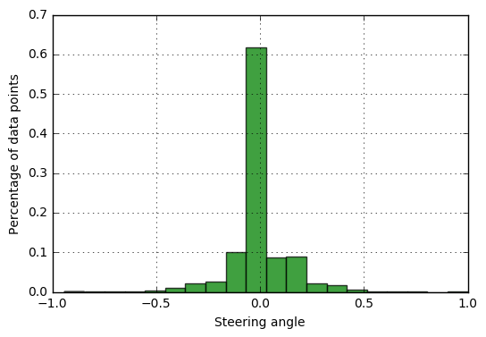
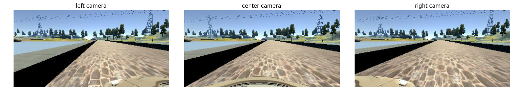
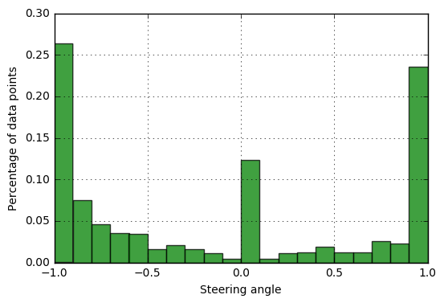
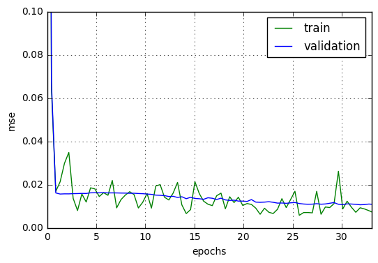
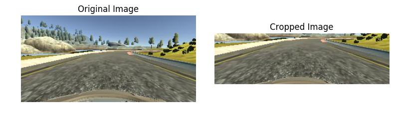
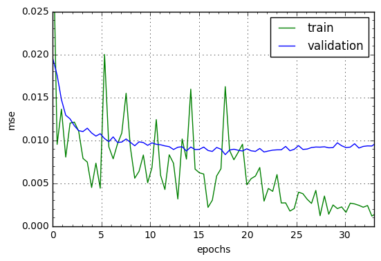
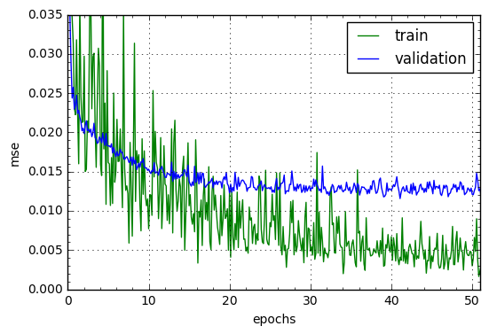
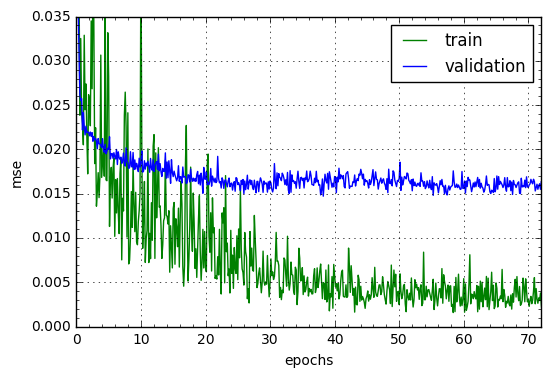

## Behavioral Cloning Project
The goals / steps of this project are the following:

- Use the simulator to collect data of good driving behavior
- Build, a convolution neural network in Keras that predicts steering angles from images
- Train and validate the model with a training and validation set
- Test that the model successfully drives around track one without leaving the road
- Summarize the results with a written report

We kept 2 additional goals

1. Test that the model successfully drives around track2 without leaving the road
2. Train the model only using track1 data. Never show the model data of track2. Yet the car should be able to successfully drive around track2


### Files Submitted & Code Quality
#### 1. Submission includes all required files and can be used to run the simulator in autonomous mode

My project includes the following files:

1. [model.py](./mode.py) is the script to create and train the model
2. [preprocess.py](./preprocess.py) to preprocess the images before feeding those into the network
3. [drive.py](./drive.py) for driving the car in autonomous mode
4. [model.h5](./model.h5) is a trained keras model of convolution neural network that can drive the car in track1 as well as track2
	5. Note that we have tested model.h5 on a MacBook Pro with 2.8Ghz Intel core i7 processor. We are able to run the car at max speed 30mph. To make it work on a slower machine one might have to reduce the speed by putting lower value for throttle.
5. [writeup.md](./writeup.md) is the write up summarizing the approach and the results

#### 2. Submission includes functional code
Using the Udacity provided simulator and my drive.py file, the car can be driven autonomously around the track1 and track2 by executing
```
python drive.py model.h5
```

#### 3. Submission code is usable and readable
The [model.py](./model.py) file contains the code for training and saving the convolution neural network. The file shows the pipeline I used for training and validating the model.

The [preprocess.py](./preprocess.py) file contains the preprocessing code applied to an image before feeding the image into the network.

### Model Architecture and Training Strategy


#### 1. An appropriate model architecture has been employed
I have used the same model used in [Nvidia's End To End driving](https://arxiv.org/pdf/1604.07316.pdf). The model takes a *200 x 66* image and predicts the desired steering angle of the car.

The model layers and parameters are as follows

Layer (type) | Filter Shape | Subsample | Output Shape | Activation | Param #
--- | --- | --- | --- | --- |  ---
input | - | - | 66 x 200 x3 | relu | 0
convolution 1 | 24@5x5 | 2x2 | 31 x 98 x 24  | relu | 1,824
convolution 2 | 36@5x5 | 2x2 | 14 x 47 x 26 | relu | 21,636
convolution 3 | 48@5x5 | 2x2 | 5 x 22 x 48 | relu | 43,248
convolution 4 | 64@3x3 | None | 3 x 20 x 64 | relu | 27,712
convolution 5 | 64@3x3 | None | 1 x 18 x 64 | relu | 36,928
Flatten | - | - | 1152 | relu | 0
Fully Connected 1 | -  | - | 1164 | relu | 1,342,092
Fully Connected 2 | - | - | 100 | relu | 116,500
Fully Connected 3 | - | - | 50 | relu |5050
Fully Connected 4 | - | - | 10 | relu |510
Fully Connected 5 | - | - | 1 | tanh | 11

Total number of parameters = 1,595,511

Since we are using tanh activation the output is restricted between -1 to +1.

#### 2. Attempts to reduce overfitting in the model
**Dropout**  To reduce overfitting applied dropout after the following layers
1. Flatten
2. Fully Connected 1
3. Fully Connected 2
Through out dropout probablity was set to 0.5

**Image Augmentation** To reduce the effect of overfitting we increase the number of training data point. Particularly include some noisy training data, e.g. angle shifted images taken from left and right cameras.

#### 4. Appropriate training data

##### Udacity Data
Udacity provided [sample training data](https://d17h27t6h515a5.cloudfront.net/topher/2016/December/584f6edd_data/data.zip) for track1. We will use the Udacity data as the main source of our training and validation data.

##### Quick summary of the Udacity data
Steering Angle | Number of Data Points | Percentage
---- | --- | ---
0.0  (straight) | 4361 | 54%
Less than 0.0 (right turn) | 1776 | 22%
Greater than 0.0 (left turn) | 1900 | 24%
Total | 8037 | 100%

The histogram of the steering angles are shown in the figure below


We can see that the Udacity data is heavily skewed towards driving straight at steering angle close to 0.0. This is good enough for track1. But to drive around in the track2 the car needs to take some sharp turns. Udacity data is not enough to train the model in taking sharp turns. 

#### Sharp Turn Data
To train the model to take sharp turns we created some sharp turn data. In particular, we recorded some dataset where the car is *driving away* from the curb or fence. We positioned the car very close to a curb or a fence and then start recording while it takes sharp turn to drive away from the curb/fence. Note that as mentioned in the goals we created this data set from track1 only.

The full video of this training data is available in the link below

[](https://youtu.be/4Twg8Gj2Nuk)

An example image of this training dataset from all three; left, center and right cameras are shown below.


The histogram of the steering angles for this dataset is shown below.


Total number of data points in this dataset is **738**

Compare this with the histogram of the steering angle for the Udacity dataset. In this dataset, almost 50% of the data points have close to -1.0 or 1.0 steering angles.

#### Train Validation Split
Through out this project will use 90% - 10% split of the dataset and use the 90% split to train the model and 10% as the validation set. We only keep the center images in the validation set even when we augment the left and right images in the training set.
The validation set will be used to detect overfitting and tune parameters like the number of Epochs for training etc.
The final testing is done on the actual simulator based on whether or not the car is able to drive around in a given track.

###  Architecture and Training Documentation
#### 1. Solution Design Approach
As mentioned at the beginning that we have following goals for the trained model
	1. The model should be able to successfully drive around the car in track1
	2. The model should be able to successfully drive around the car in track2
	3. The model is trained only using the track1 data but it should be able to generalize to track2
	
We will explore following solutions in sequence to achieve our goals
	1. **Baseline** trained only on the center images of the Udacity data
	2. **Image Normalization** Same as baseline, but the images will be cropped and normalized
	3. **Augment Left/Right Images** Left/Right images are augmented after shifting the angle
	4. **Include Sharp Turn Data** In addition to the udacity data we will use the sharp turn dataset that we have created.

#### 1. Baseline

**Training Data**
	- Only the center images of the udacity training data is used
	- There 7232 center images in the training set and 803 images in the validation set

**Preprocessing**
	- The images are resized to *200x66*

**Training Parameters**
We will use the following parameter configuration for all the experiements
	- BATCH_SIZE = 64
	- Optimizer = Adam
	- Learning Rate = 0.0001

**Loss**



**Observations**
	- The loss is decreasing very slowly. This is because the pixel values of the input image ranges between 0 and 255. The activation of the final layer is *tanh*. High values of input makes the output to stay close to -1.0 or 1.0 where the derivative is close to zero. So at each iterations the parameters are updated with small changes. Therefore the convergence is slow.
	- Training loss is fluctuating a lot. The model is very unstable. Possibly the output values are just toggling between -1.0 and 1.0.

**Final Result** 
	- The car goes out of the road within few seconds of driving. It is not able to take any turn.
 
#### 2. Image Normalization
 In this experiment, we aim to address the problem of high input values by scaling the inputs. In particular, we apply image normalization to scale the pixel values. We also include image cropping to remove the portion of the image that is not useful in taking driving decision.
 
**Training Data** Same as above

**Preprocessing**
	1. Cropping: The upper part of the image shows the sky and trees, not relevant to driving decisions. Few rows at the bottom of the image mostly show the bonnet of the car. So we crop the images from 56 to 150 rows of an image
```
img_crop = img[56:150, :, :]
```
The picture below shows the original and the cropped images.

2. Normalization: We apply per-channel normalization by subtracting the mean and dividing by standard deviation of each channel. This will make most pixel values in the range of -1.0 to 1.0, addressing the problem of large input values we saw in case of baseline.
```
def normalize_image(img):
    means = np.mean(img, axis=(0, 1))
    means = means[None,:]
    std = np.std(img, axis=(0, 1))
    std = std[None,:]
    return (img - means) / std
```

**Loss**



**Observations**
	- Loss decreases much faster than Baseline. 
	- Loss is lower than baseline, we achieved lower than 0.010 validation loss.
	- The validation loss starts increasing after epochs 16-17 but the training loss continues to decrease. So the model is overfitting the training data.

**Final Results**
	- The care has now learnt to take few truns
	- It is able to cross the bridge in the track1 and after that it goes off the road
	- Overall a very good progress from baseline

#### 3. Use Left/Right Images
In the above experiment, we faced the problem of overfitting. One way to address the problem of overfitting is by including more training data. Particularly inclusion of lots of noisy data in the training set helps in reducing the effect of overfitting.

**Training Data**
When recording training data, the images are captured using 3 cameras, left, center and right. Udacity Data also comes with left, center and right images. During actual driving in the simulator images only from the center camera is available. But we can train the model using images from all 3 cameras even though during actual driving images from only the center camera will be used. In fact, since left and right images looks different than the center images they are perfectly suited as noisy training examples to reduce the effect of overfitting.

Directly using the left and right images as training data is not a good idea since the model will be trained mostly on different type of images than what it will see during actual driving. We shift the steering angle by +0.25 for the left images and by -0.25 for the right images. The idea is that we shift the steering angle for left and right images so that the center camera sees the same image as seen by the corresponding left or right camera. For example, we assume when the car is turned additional +0.25 radian towards right it will see the same image as seen by the left camera in the current position.

After the image augmentation we literally triple our dataset. Earlier in the training set we had 7232 data points. After augmenting left/right images the training set contains 21K images. Note that there is no change in the validation set as we continue to use only the center images in the validation set.

**Preprocessing**
Same as above

**Loss**

loss at 30 epochs


loss at 50 epochs


**Observation**
	- We achieved lower validation loss than what we achieved earlier. The validation loss is lower than 0.010 now
	- Validation loss is more stable and the impact of overfitting is less noticeable. 
	- Validation loss still slightly increased from epoch 10 to 30. So there is still some overfitting

**Final Result**
- The car is now able to successfully drive around track1. The full video is uploaded in the youtube and can be played by clicking on the following image.
[](https://youtu.be/Ch1ymTUpRhk)

- It still fails to drive around in the track2. The car hits the side rock on a sharp turn. Next we will train the car to learn to take sharp turns.

#### 3. Include Sharp Turn Images
As mentioned above the car is able to successfully drive around track1 but fails to take sharp turns in track2. We have shown earlier that the udacity data heavily skewed towards zero steering angle. That's why we have created the sharp turn data which shows examples of quickly moving the car away from the curb or side rocks. Next we will train the model including this sharp turn data.

**Training Data**
	- Udacity Data and Sharp Turn Data combined
	- Total number of data points 8037 + 738 = 8775
	- After Train and Validation split, training set contains 23689 data points and the validation set contains 893 data points

**Preprocessing**
Same as above

**Loss**

Loss at 50 epochs


Loss at 70 epochs


**Observations**
	- The sign of overfitting is not obvious. We can train the model for large number of iterations (typically 50 to 70 epochs). Higher number of iteration generates more stable model that does not vary between different runs.
	- Validation loss is higher, this due to the fact we have included many high steering angle data in the validation 

**Final Results**
	- The model is able to successfully drive around the track1
	- The model is able to successfully drive around the track2. We have uploaded the track2 video on youtube and can be played by clicking on the image below.
[](https://youtu.be/odYl6ilQ3Kc)
	- The model is trained using the track1 data. It has never seen the data of track2 yet it is able to drive around track2

#### 2. Final Model Architecture
- The convolution network as shown in the model architecture section
- The model is trained on udacity data + sharp turn data
- Images were cropped and per-channel image normalization was applied
- Images from the left and right cameras were used after angle shift
- The batch size, optimizer and learning rates are kept same through out as mentioned above 
- The model was trained for 70 epochs